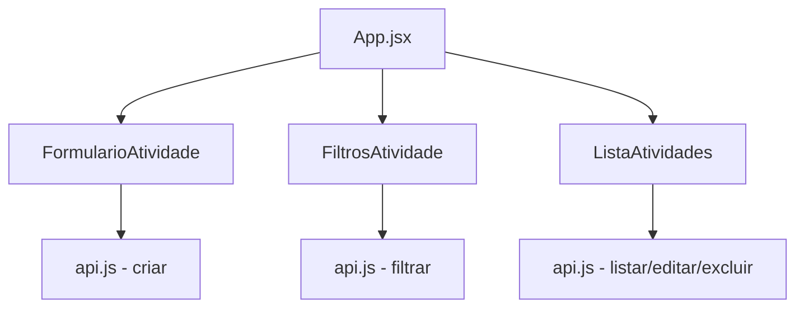

# Frontend - React Application

## Visão Geral

O frontend é uma aplicação **React 19** moderna construída com **Vite** como build tool, proporcionando uma experiência de desenvolvimento rápida e otimizada. A interface foi desenvolvida com foco em usabilidade, responsividade e performance.

### **Características Principais**

- **SPA (Single Page Application)**: Navegação fluida sem recarregamento de página
- **Responsive Design**: Interface adaptável para desktop e mobile
- **Componentes Modulares**: Arquitetura baseada em componentes reutilizáveis
- **Estado Local**: Gerenciamento com React Hooks (useState, useEffect)
- **Validação Client-side**: React Hook Form com validações em tempo real
- **Hot Module Replacement**: Desenvolvimento com live-reload

---

## Stack Tecnológica Detalhada

### **Core Technologies**

| Tecnologia          | Versão               | Descrição                                 |
| ------------------- | -------------------- | ----------------------------------------- |
| **React**           | 19.1.1               | Biblioteca para criação de interfaces     |
| **Vite**            | rolldown-vite@7.1.12 | Build tool moderna e otimizada            |
| **JavaScript ES6+** | -                    | Linguagem principal com features modernas |

### **Dependências Principais**

```json
{
  "dependencies": {
    "react": "^19.1.1",
    "react-dom": "^19.1.1",
    "axios": "^1.12.2",
    "react-hook-form": "^7.63.0",
    "date-fns": "^4.1.0"
  },
  "devDependencies": {
    "@vitejs/plugin-react": "^5.0.3",
    "eslint": "^9.36.0",
    "vite": "npm:rolldown-vite@7.1.12"
  }
}
```

### 🔧 **Ferramentas de Desenvolvimento**

- **ESLint**: Linting e padronização de código
- **Vite Dev Server**: Servidor de desenvolvimento com HMR
- **PostCSS**: Processamento de CSS
- **React Developer Tools**: Debug e profiling (browser extension)

---

## 📁 Estrutura do Projeto

### 🏗️ **Organização de Arquivos**

```
front-end/
├── public/                  # Assets estáticos
│   └── vite.svg            # Logo do Vite
├── src/                    # Código fonte
│   ├── components/         # Componentes reutilizáveis
│   │   ├── FiltrosAtividade.jsx
│   │   ├── FiltrosAtividade.css
│   │   ├── FormularioAtividade.jsx
│   │   ├── FormularioAtividade.css
│   │   ├── ListaAtividades.jsx
│   │   └── ListaAtividades.css
│   ├── services/           # Camada de comunicação
│   │   └── api.js          # Cliente HTTP (Axios)
│   ├── assets/            # Assets do projeto
│   │   └── react.svg      # Logo do React
│   ├── App.jsx            # Componente raiz
│   ├── App.css            # Estilos globais da aplicação
│   ├── main.jsx           # Entry point
│   └── index.css          # Reset CSS e estilos base
├── package.json           # Dependências e scripts
├── vite.config.js         # Configuração do Vite
├── eslint.config.js       # Configuração do ESLint
└── index.html             # Template HTML
```

### 🧩 **Arquitetura de Componentes**



---

## 🧩 Detalhamento dos Componentes

### 📝 **FormularioAtividade.jsx**

Componente responsável pelo cadastro e edição de atividades:

```javascript
const FormularioAtividade = ({
  onAtividadeCriada,
  atividadeParaEdicao,
  onCancelarEdicao,
}) => {
  const {
    register,
    handleSubmit,
    formState: { errors },
    reset,
  } = useForm({
    defaultValues: {
      funcional: "",
      dataHora: "",
      codigoAtividade: "",
      descricaoAtividade: "",
    },
  });

  const onSubmit = async (data) => {
    try {
      if (atividadeParaEdicao) {
        await atividadeService.atualizar(atividadeParaEdicao.idAtividade, data);
      } else {
        await atividadeService.criar(data);
      }
      reset();
      onAtividadeCriada();
    } catch (error) {
      console.error("Erro ao salvar atividade:", error);
    }
  };

  return (
    <form onSubmit={handleSubmit(onSubmit)} className="formulario-atividade">
      {/* Campos do formulário com validações */}
    </form>
  );
};
```

**Funcionalidades:**

- ✅ Criação de novas atividades
- ✅ Edição de atividades existentes
- ✅ Validação client-side com React Hook Form
- ✅ Reset automático após submit
- ✅ Tratamento de erros

### 🔍 **FiltrosAtividade.jsx**

Componente para filtros avançados de busca:

```javascript
const FiltrosAtividade = ({ onFiltroAplicado }) => {
  const [filtros, setFiltros] = useState({
    funcional: "",
    codigoAtividade: "",
    descricaoAtividade: "",
    dataInicio: "",
    dataFim: "",
  });

  const aplicarFiltros = () => {
    const filtrosLimpos = Object.fromEntries(
      Object.entries(filtros).filter(([_, value]) => value.trim() !== "")
    );
    onFiltroAplicado(filtrosLimpos);
  };

  const limparFiltros = () => {
    setFiltros({
      funcional: "",
      codigoAtividade: "",
      descricaoAtividade: "",
      dataInicio: "",
      dataFim: "",
    });
    onFiltroAplicado({});
  };

  return <div className="filtros-atividade">{/* Campos de filtro */}</div>;
};
```

**Funcionalidades:**

- 🔍 Filtro por funcionário (funcional)
- 🏃‍♂️ Filtro por tipo de atividade
- 📝 Filtro por descrição (busca textual)
- 📅 Filtro por período (data início/fim)
- 🗑️ Limpeza de todos os filtros

### 📋 **ListaAtividades.jsx**

Componente principal para exibição e gerenciamento das atividades:

```javascript
const ListaAtividades = ({
  atividades,
  onEditarAtividade,
  onAtividadeExcluida,
}) => {
  const [atividadeParaExcluir, setAtividadeParaExcluir] = useState(null);

  const confirmarExclusao = async () => {
    try {
      await atividadeService.excluir(atividadeParaExcluir.idAtividade);
      setAtividadeParaExcluir(null);
      onAtividadeExcluida();
    } catch (error) {
      console.error("Erro ao excluir atividade:", error);
    }
  };

  const formatarDataHora = (dataHora) => {
    return format(new Date(dataHora), "dd/MM/yyyy HH:mm", { locale: ptBR });
  };

  return (
    <div className="lista-atividades">
      {atividades.map((atividade) => (
        <div key={atividade.idAtividade} className="atividade-card">
          {/* Conteúdo do card */}
          <div className="atividade-acoes">
            <button onClick={() => onEditarAtividade(atividade)}>Editar</button>
            <button onClick={() => setAtividadeParaExcluir(atividade)}>
              Excluir
            </button>
          </div>
        </div>
      ))}

      {/* Modal de confirmação de exclusão */}
      {atividadeParaExcluir && (
        <ModalConfirmacao
          onConfirmar={confirmarExclusao}
          onCancelar={() => setAtividadeParaExcluir(null)}
        />
      )}
    </div>
  );
};
```

**Funcionalidades:**

- 📋 Listagem paginada de atividades
- ✏️ Botão de edição inline
- 🗑️ Exclusão com confirmação
- 📅 Formatação de datas com date-fns
- 📱 Layout responsivo em cards

---

## Comunicação com API

### 🔌 **Cliente HTTP (api.js)**

```javascript
import axios from "axios";

// Configuração dinâmica de base URL
export const getBaseURL = () => {
  const hostname = window.location.hostname;
  const protocol = window.location.protocol;
  return `${protocol}//${hostname}:8080`;
};

// Instância configurada do Axios
const api = axios.create({
  baseURL: getBaseURL(),
  headers: {
    "Content-Type": "application/json",
  },
  timeout: 10000, // 10 segundos
});

// Interceptor para tratamento de erros
api.interceptors.response.use(
  (response) => response,
  (error) => {
    console.error("Erro na requisição:", error);
    if (error.response?.status === 500) {
      alert("Erro interno do servidor. Tente novamente.");
    }
    return Promise.reject(error);
  }
);

export const atividadeService = {
  // Listar com filtros opcionais
  listar: async (filtros = {}) => {
    const params = new URLSearchParams();
    Object.entries(filtros).forEach(([key, value]) => {
      if (value) params.append(key, value);
    });

    const response = await api.get(`/atividades?${params}`);
    return Array.isArray(response.data) ? response.data : [];
  },

  // Criar nova atividade
  criar: async (dadosAtividade) => {
    const response = await api.post("/atividades", dadosAtividade);
    return response.data;
  },

  // Buscar por ID
  buscarPorId: async (id) => {
    const response = await api.get(`/atividades/${id}`);
    return response.data;
  },

  // Atualizar existente
  atualizar: async (id, dadosAtividade) => {
    const response = await api.put(`/atividades/${id}`, dadosAtividade);
    return response.data;
  },

  // Excluir atividade
  excluir: async (id) => {
    await api.delete(`/atividades/${id}`);
  },
};
```

### 🔄 **Gerenciamento de Estado**

```javascript
// App.jsx - Estado principal da aplicação
const App = () => {
  const [atividades, setAtividades] = useState([]);
  const [loading, setLoading] = useState(false);
  const [atividadeParaEdicao, setAtividadeParaEdicao] = useState(null);

  // Carregar atividades iniciais
  useEffect(() => {
    carregarAtividades();
  }, []);

  const carregarAtividades = async (filtros = {}) => {
    setLoading(true);
    try {
      const dados = await atividadeService.listar(filtros);
      setAtividades(dados);
    } catch (error) {
      console.error("Erro ao carregar atividades:", error);
    } finally {
      setLoading(false);
    }
  };

  const handleAtividadeCriada = () => {
    carregarAtividades();
    setAtividadeParaEdicao(null);
  };

  const handleFiltroAplicado = (filtros) => {
    carregarAtividades(filtros);
  };

  const handleEditarAtividade = (atividade) => {
    setAtividadeParaEdicao(atividade);
  };

  return (
    <div className="App">
      <h1>Sistema de Atividades Físicas</h1>

      <FormularioAtividade
        onAtividadeCriada={handleAtividadeCriada}
        atividadeParaEdicao={atividadeParaEdicao}
        onCancelarEdicao={() => setAtividadeParaEdicao(null)}
      />

      <FiltrosAtividade onFiltroAplicado={handleFiltroAplicado} />

      {loading ? (
        <div className="loading">Carregando...</div>
      ) : (
        <ListaAtividades
          atividades={atividades}
          onEditarAtividade={handleEditarAtividade}
          onAtividadeExcluida={handleAtividadeCriada}
        />
      )}
    </div>
  );
};
```

---

## Estilos e Interface

### 🖌️ **Abordagem de Estilos**

- **CSS Modules**: Estilos isolados por componente
- **BEM Methodology**: Nomenclatura consistente de classes
- **Responsive Design**: Mobile-first approach
- **CSS Variables**: Cores e medidas centralizadas

### 🎨 **Design System**

```css
/* index.css - Variáveis globais */
:root {
  --primary-color: #646cff;
  --secondary-color: #535bf2;
  --success-color: #28a745;
  --error-color: #dc3545;
  --warning-color: #ffc107;

  --font-family: Inter, system-ui, Avenir, Helvetica, Arial, sans-serif;
  --border-radius: 8px;
  --box-shadow: 0 2px 8px rgba(0, 0, 0, 0.1);
  --transition: all 0.2s ease-in-out;
}

/* Reset e estilos base */
* {
  box-sizing: border-box;
  margin: 0;
  padding: 0;
}

body {
  font-family: var(--font-family);
  line-height: 1.5;
  color: #213547;
  background-color: #ffffff;
}
```

### 📱 **Responsividade**

```css
/* Mobile First - Base styles */
.formulario-atividade {
  display: grid;
  gap: 1rem;
  padding: 1rem;
}

/* Tablet */
@media (min-width: 768px) {
  .formulario-atividade {
    grid-template-columns: repeat(2, 1fr);
    padding: 1.5rem;
  }
}

/* Desktop */
@media (min-width: 1024px) {
  .formulario-atividade {
    grid-template-columns: repeat(4, 1fr);
    max-width: 1200px;
    margin: 0 auto;
  }
}
```

---

## Performance e Otimizações

### 🚀 **Build Otimizado**

```javascript
// vite.config.js
import { defineConfig } from "vite";
import react from "@vitejs/plugin-react";

export default defineConfig({
  plugins: [react()],
  build: {
    // Otimizações de build
    minify: "esbuild",
    target: "es2015",
    rollupOptions: {
      output: {
        manualChunks: {
          vendor: ["react", "react-dom"],
          utils: ["axios", "date-fns"],
        },
      },
    },
  },
  server: {
    port: 5173,
    host: true, // Permite acesso externo
  },
});
```

### ⚡ **Otimizações Implementadas**

- **Code Splitting**: Separação de bundles vendor/utils
- **Tree Shaking**: Eliminação de código não usado
- **Minificação**: ESBuild para JavaScript
- **Hot Module Replacement**: Desenvolvimento otimizado
- **Lazy Loading**: Componentes carregados sob demanda

---

## Como Executar

### 🚀 **Desenvolvimento Local**

```bash
# Instalar dependências
cd front-end
npm install

# Servidor de desenvolvimento
npm run dev

# Build para produção
npm run build

# Preview da build de produção
npm run preview

# Linting
npm run lint
```

### 🐳 **Com Docker**

```bash
# Via Docker Compose (recomendado)
docker-compose up frontend

# Ou build individual
cd front-end
docker build -t atividade-frontend .
docker run -p 5173:5173 atividade-frontend
```

### ⚙️ **Variáveis de Ambiente**

```bash
# .env.local
VITE_API_URL=http://localhost:8080
VITE_APP_NAME="Sistema de Atividades"
VITE_APP_VERSION="1.0.0"
```

---

## Debugging e Ferramentas

### 🛠️ **Ferramentas de Desenvolvimento**

1. **React Developer Tools** (Browser Extension)

   - Inspeção de componentes
   - Profiling de performance
   - Estado e props em tempo real

2. **Vite Dev Tools**

   - HMR status
   - Bundle analysis
   - Performance metrics

3. **Browser DevTools**
   - Network tab para requisições
   - Console para logs
   - Application tab para local storage

### 📊 **Monitoramento**

```javascript
// Logging estruturado
const logger = {
  info: (message, data) => console.log(`[INFO] ${message}`, data),
  warn: (message, data) => console.warn(`[WARN] ${message}`, data),
  error: (message, error) => console.error(`[ERROR] ${message}`, error),
};

// Uso nos componentes
try {
  const atividades = await atividadeService.listar(filtros);
  logger.info("Atividades carregadas com sucesso", {
    count: atividades.length,
  });
  setAtividades(atividades);
} catch (error) {
  logger.error("Erro ao carregar atividades", error);
}
```

---

## 🔮 Próximas Funcionalidades

### 📈 **Roadmap Frontend**

- [ ] **Autenticação JWT**: Login/logout com token
- [ ] **Dashboard Analytics**: Gráficos com Chart.js
- [ ] **PWA**: Aplicação instalável offline-first
- [ ] **Dark Mode**: Tema escuro/claro
- [ ] **Internacionalização**: Multi-idiomas (i18n)
- [ ] **Drag & Drop**: Upload de arquivos
- [ ] **Real-time**: WebSocket para atualizações live
- [ ] **Cache**: React Query para cache inteligente
